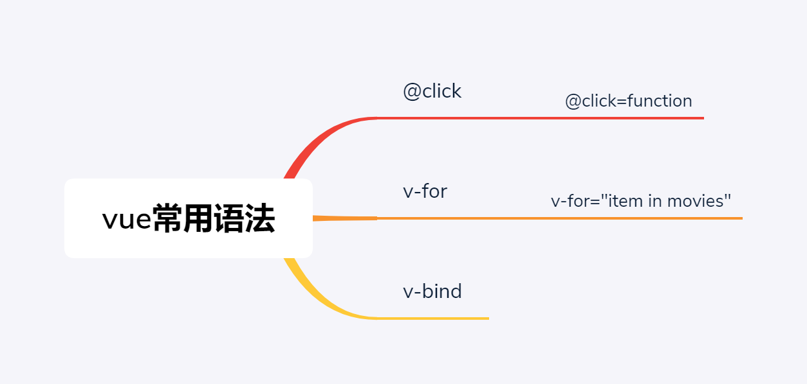

## 安装

----------

### CDN直接引用

- 开发环境
	- 
- 生产环境
	- 

----------

### 下载引入

 - 开发环境
	 - wget https://vuejs.org/js/vue.js
 - 生产环境
	 -  wget https://vuejs.org/js/vue.min.js

----------

### npm安装

### 安装nodejs
yum install -y nodejs
升级到最新版
curl -sL https://rpm.nodesource.com/setup_14.x | bash -

### 安装vue-cli

 - npm config set registry https://registry.npm.taobao.org/
 - npm install -g cnpm
 - cnpm install -g @vue/cli 

----------
## 语法

### 实例属性

 - el 挂载点，用于绑定一个dom元素及其所有子元素
 - data 数据，可以传对象或者函数，对象在el里面可以直接用{{}}引用，函数是组件化用的
 - computed 计算属性，本质是个属性，但是实现了get方法和set方法，一般没有set方法
 - methods 方法，用于写js函数，方便和dom事件绑定
 - filters 过滤器，本质是函数
 - components 局部组件注册
  

----------

## 组件化

### 思想
分而治之+复用

### 实现

 - 创建组件构造器
	 - Vue.extend()
 - 注册组件
	 - Vue.component()
 - 使用组件

### 通信

#### 父子组件之间通信
 - 父组件向子组件传递消息
	 - props
 - 子组件向父组件传递消息
	 - events

## 流行框架
 - Vuetify

 
